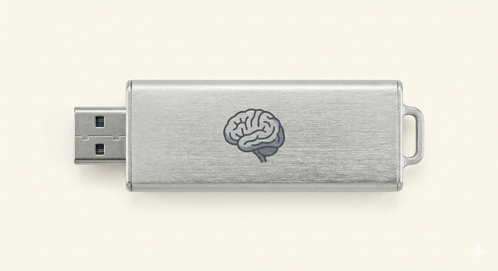
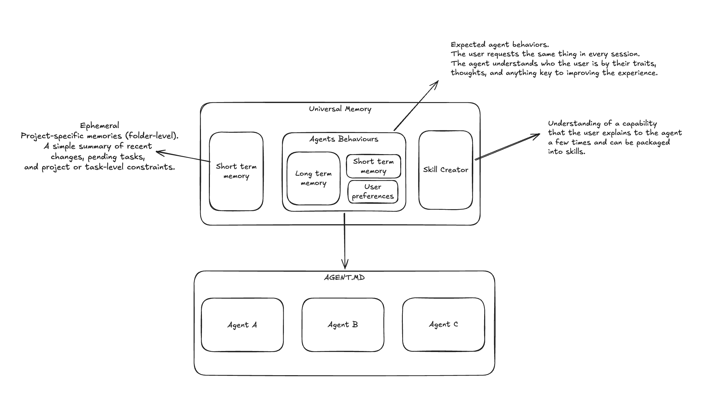

<p align="center">
  
</p>

# Universal Memory (umem)

[](https://pypi.org/project/universal-memory/)
[](https://pypi.org/project/universal-memory/)
[](https://github.com/YanAmorelli/universal-memory/blob/dev/LICENSE)

A vendor-agnostic cognitive persistence layer for AI agents. Eliminate the "repetition tax" by transporting your context, preferences, guidelines, and history seamlessly across sessions, IDEs, and LLM models.

To see the core idea visually, check out the [Excalidraw design](https://excalidraw.com/#json=j3XjQIWMYEnkIzHpypuBb,rNJaVOECDGZ3WSuEYcCDjQ) or the proposal structure:



### Diagram Breakdown

*   **Short-Term Memory (Ephemeral):** Project-specific (folder-level) memories. A simple summary of recent changes, pending tasks, and project or task-level constraints.
*   **Agents Behaviours:** Comports the user's expected agent behaviors. Instead of requesting the same settings in every session, the agent understands the user by their traits, thoughts, and any context key to enhancing the overall experience. This encompasses:
    *   **Long-Term Memory**
    *   **Short-Term Memory**
    *   **User Preferences**
*   **Skill Creator:** Encapsulates understanding of specific workflows. When a user explains a task pattern multiple times, the system translates it into structured, reusable agent skills.
*   **Unified Instruction File (`AGENT.MD`):** The shared persistence endpoint consumed by all local agent instances (e.g., Agent A, Agent B, Agent C).

---

## The Problem: The "Repetition Tax"

Every time you open a new session in Claude Code, start a new chat in Cursor, spin up a terminal with OpenCode, or invoke a local AI assistant, you pay a steep cognitive tax:
* Re-explaining your stack (e.g., "We use Python 3.12, Typer, and Ruff").
* Repeating coding style preferences (e.g., "Prefer functional design, do not write docstrings unless requested").
* Copy-pasting database connection schemas or module layouts.
* Explaining workflow methodologies (e.g., "We follow Spec-Driven Development (SDD)").

Universal Memory acts as a local "Cognitive USB Drive" that automatically connects to your AI runtimes, aligning them to your exact workflow, context, and rules with zero friction.

---

## Key Architectural Concepts

### 1. Dual-Memory Model
*   **Short-Term Memory (Project Scope):** Ephemeral, directory-specific context. Tracks what you did 10 minutes ago, current active tasks, and immediate constraints.
*   **Universal Memory (Global Scope):** Long-lived preferences, style guidelines, tool configurations, and identity.

### 2. Auto-Adaptation Engine
Instead of copy-pasting instructions, `umem` monitors your session context and automatically updates active project instruction manifests (`AGENTS.md`, `CLAUDE.md`, `.cursor/rules/`, etc.), enforcing operational consistency across all agents.

### 3. Model Context Protocol (MCP) Integration
Integrate `umem` natively with any client supporting the standard MCP (such as Claude Desktop or Cursor). AI agents can programmatically retrieve context, learn new facts, and suggest skills on the fly.

### 4. Agent Skills Standard
Encapsulates complex, repetitive procedural instructions into formal Agent Skills (conforming to the [agentskills.io](https://agentskills.io) standard), complete with structured directories containing `SKILL.md` instructions, helper `scripts/`, and documentation `references/`.

---

## Installation & Setup

Ensure you have Python 3.12+ installed. You can run or install `umem` using your preferred package manager.

### Try instantly with `uvx`
You can run `umem` without installing it permanently:
```bash
uvx --from universal-memory umem --help
```

> [!WARNING]
> `uvx` is best for quick trials. For ongoing use, install Universal Memory as a persistent tool so `umem` is always available and can fully manage long-lived global memories and synced agent skills:
> ```bash
> uv tool install universal-memory
> ```

### Install via PyPI
```bash
pip install universal-memory
```

---

## Quick Start Guide

### 1. Initialize your project
Initialize `umem` in the current directory and hook it to your preferred runtimes/agents:
```bash
umem init --runtime claude-code --runtime opencode --runtime cursor
```
This sets up a local repository configuration, hooks up the necessary workspace instructions (`AGENTS.md`, `CLAUDE.md`), and prepares native skill folders.

### 2. Save your first preferences and facts
Tell `umem` what to keep in mind. You can target either the project scope (this folder) or the global scope (across all projects):
```bash
# Save a global preference
umem remember --scope global "Yan is a solutions architect specializing in AI applications"

# Save a project-specific constraint
umem remember --scope project "Always use Tomllib instead of PyYAML for configuration files" --tag config
```

### 3. Retrieve Context
Verify the consolidated context summary generated by combining short-term facts, rules, and global preferences:
```bash
umem context --scope project
```

### 4. Check status and health
```bash
umem status
```

---

## Host Integration & Support Matrix

`umem` maps cognitive context and agent skills directly into native runtime paths:

| Runtime / Host | Support Tier | Config / Instructions Target |
| --- | --- | --- |
| **Claude Code** | Tier 1 (Full) | `CLAUDE.md`, `.claude/`, `~/.claude/` |
| **OpenCode** | Tier 1 (Full) | `AGENTS.md`, `.opencode/`, `~/.config/opencode/` |
| **Codex (OpenAI)** | Tier 1 (Full) | `AGENTS.md`, workspace configuration files |
| **Cursor** | Tier 2 (Basic) | `.cursor/rules/`, `~/.cursor/` |
| **Antigravity / Gemini** | Tier 2 (Basic) | `GEMINI.md`, `~/.gemini/` |

---

## Running as an Model Context Protocol (MCP) Server

AI agents can interact directly with your memory over the Model Context Protocol.

### CLI Launch Command
```bash
umem-mcp
```

### Example Config: Claude Desktop (`claude_desktop_config.json`)
```json
{
  "mcpServers": {
    "universal-memory": {
      "command": "uv",
      "args": [
        "run",
        "--package",
        "universal-memory",
        "umem-mcp"
      ]
    }
  }
}
```

---

## Safety & Guardrails

*   **API Secret Scanner:** `umem` passes all incoming facts through a passive scanner to block API keys, tokens, or credentials from being stored in your persistent cognitive base.
*   **Snapshots & Rollbacks:** Every automated update to your config files (`AGENTS.md`, `CLAUDE.md`) is preceded by a snapshot backup. You can rollback anytime:
    ```bash
    # View audit logs
    umem audit list --scope project
    
    # Revert last automated modification
    umem rollback --scope project
    ```
*   **Update Conflict Warnings:** When updating canonical skills, if `umem` detects manual edits in local runtime rule directories (e.g. `.cursor/rules/sdd-rules.md`), it prompts you interactivelly to choose whether to keep your local edits or overwrite them, preventing workflow disruption.

---

## Managing Agent Skills

You can create, list, and sync specialized behaviors:
```bash
# List all active skills
umem skills list

# Synchronize skills into active native runtime folders
umem update --skills

# Generate a new skill template from a latent skill proposal
umem skills generate --name build-standard
```

---

## License

Distributed under the MIT License. See [LICENSE](LICENSE) for more information.
