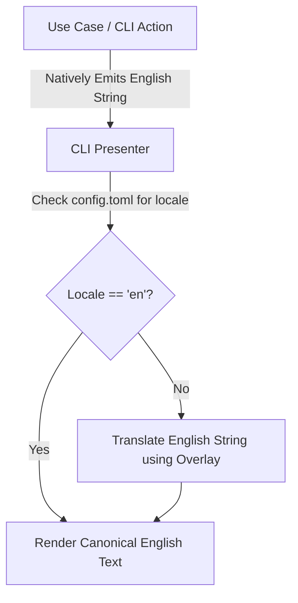
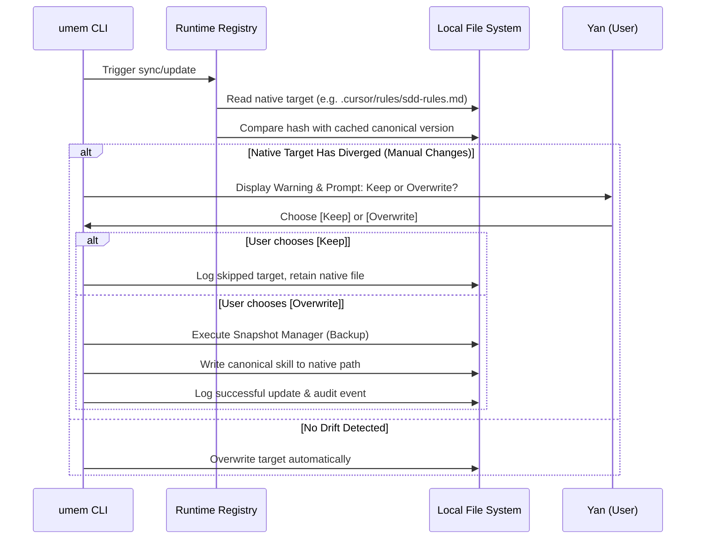

# Architecture Decision Document

*This document builds collaboratively through step-by-step discovery. Sections are appended as we work through each architectural decision together.*

## Project Context Analysis

### Requirements Overview

**Functional Requirements:**
28 functional requirements organized into 8 domains:
1. **Core Memory Management (FR1–FR6):** Readable local persistence, logical STM/LTM separation, search by local modes, manual editing, selective purging, context hygiene.
2. **Onboarding & Setup (FR7–FR9):** Provider selection, automatic configuration of instruction files, CLI initialization.
3. **CLI (FR10–FR11):** Memory status, full parity with API/MCP.
4. **MCP Interface (FR12–FR14):** Native MCP server (JSON-RPC), context read and write by external agents.
5. **Auto-Adaptation & Sync (FR15–FR17):** Dynamic update of AGENTS.md/CLAUDE.md, STM injection with summarization, token overflow control.
6. **Skill Creation Engine (FR18–FR21):** Tracking of latent skills, recurrence triggering, Agent Skills structure generation, skill management via CLI.
7. **Security & Safety (FR22–FR24):** Passive secret detection, persistence blocking, audit log.
8. **Backup & Recovery (FR25–FR28):** Snapshot before mutation, block if snapshot fails, snapshot listing, scope-based rollback.

**Non-Functional Requirements:**
- **Performance:** Context queries < 150ms p95 (1,000 facts); initialization < 200ms p95; mandatory text vs. semantic benchmark (30 queries).
- **Security:** 100% blocking of secret patterns covered by the test suite; audit queryable in < 2 commands.
- **Reliability:** Automatic snapshot with a minimum retention of 5 versions per scope; rollback in < 1 minute via CLI.
- **Integration:** 100% MCP compliance; isolated internal persistence contract (storage-agnostic); validation on ≥ 2 hosts.
- **Accessibility:** Full offline-first (CLI, MCP, persistence, audit, rollback).

**Scale & Complexity:**
- Primary domain: Developer Tool / AI Middleware (CLI + MCP + Local Persistence)
- Complexity level: Medium-High
- Estimated architectural components: ~10 (Memory Engine, Adaptation Motor, Skill Engine, MCP Server, CLI, Secret Scanner, Snapshot Manager, Audit Logger, Context Summarizer, Host Configurator)

### Technical Constraints & Dependencies

- **Runtime:** Python 3.12+
- **Distribution:** PyPI + uvx
- **Storage:** Human-readable local files (JSON/Markdown) with structured metadata
- **Protocol:** MCP over JSON-RPC
- **Offline-first:** All essential capabilities without connectivity
- **Storage abstraction:** Isolated internal contract to allow future backend swapping without impacting rules engine, MCP, or CLI
- **Post-MVP readiness:** Data model must support future import/export without breaking changes

### Cross-Cutting Concerns Identified

1. **Universal Audit:** Every automatic mutation (memory, rules, skills, instruction files) generates a queryable audit record.
2. **Snapshot/Rollback:** Mandatory precondition for any automatic write; snapshot failure blocks the operation.
3. **Secret Detection:** Cross-cutting interception layer that precedes any persistence operation.
4. **CLI ↔ MCP Parity:** Every functionality exposed by one interface must exist in the other.
5. **Context Summarization:** Injection size management to respect token limits of the target LLM.
6. **Human Confirmation:** Feedback loop (Yes/Always/No) before promoting facts to rules or creating skills.

## Starter Template Evaluation

### Technical Preferences Established

- **Package Manager:** uv
- **Linting/Formatting:** Ruff (all-in-one: lint + format + import sort)
- **Type Checking:** Pyright (strict mode, VS Code/Pylance integration)
- **CLI Framework:** Typer + Rich (FastAPI-like DX, professional output)
- **MCP Framework:** FastMCP 3.x (`fastmcp>=3.3.1,<4`) (existing user experience; Components, Providers, Transforms)
- **Testing:** pytest + pytest-cov
- **Layout:** src/ with Clean Architecture
- **Distribution:** PyPI (MVP) → Container/Homebrew (post-MVP)

### Primary Technology Domain

Developer Tool / AI Middleware — CLI Tool + MCP Server (Python 3.12+)

### Starter Options Considered

| Option | Evaluation | Decision |
| :--- | :--- | :--- |
| `uv init --package` | Official scaffolding, minimal, src/ layout | ✅ Selected as base |
| Cookiecutter/Copier templates | Opinionated, generic, do not cover MCP | ❌ Unnecessary overhead |

### Selected Starter: `uv init --package` + Clean Architecture Manual

**Rationale for Selection:**
Project with specific requirements (CLI + MCP dual-interface, Clean Arch, multiple subsystems) that no generic template covers. The minimal scaffolding of `uv` gives full control over the layer structure without bringing in unwanted decisions.

**Initialization Command:**

```bash
uv init --package universal-memory
cd universal-memory
uv add "typer>=0.25.1" "rich>=15.0.0" "fastmcp>=3.3.1,<4" "pydantic>=2.13.4,<3" "tomli-w>=1.2.0"
uv add --dev pytest pytest-cov ruff pyright
```

**Architectural Decisions Provided by Starter:**

**Language & Runtime:**
Python 3.12+ with mandatory type hints (Pyright strict mode)

**CLI Framework:**
Typer + Rich for a professional terminal interface with colored output, tables, and spinners

**MCP Framework:**
FastMCP 3.x (`fastmcp>=3.3.1,<4`) — Components, Providers, Transforms. Hot reload in dev, auto-threading, granular authorization

**Build Tooling:**
uv (build, lock, run, publish) + Hatchling as build-backend

**Testing Framework:**
pytest + pytest-cov for integrated testing workflow coverage

**Code Organization:**
src/ layout with Clean Architecture — clear separation between domain, application, infrastructure, and interfaces (CLI/MCP)

**Development Experience:**
- `uv run` for execution in the correct environment without manual venv activation
- `ruff check . && ruff format .` for unified linting/formatting
- `pyright` for strict type checking
- `uv tool install . --editable` for local CLI development

**Note:** Project initialization using this command should be the first implementation story.

## Core Architectural Decisions

### Decision Priority Analysis

**Critical Decisions (Block Implementation):**
- Dual persistence format (JSON + Markdown)
- Validation with Pydantic v2
- CLI ↔ MCP parity via unified application layer (Use Cases)
- Typed domain exceptions
- TOML configuration

**Important Decisions (Shape Architecture):**
- Secret detection via regex + entropy heuristics
- Snapshot via copy + JSON manifest
- Audit logging in JSONL (append-only)
- Text search as default retrieval strategy

**Deferred Decisions (Post-MVP):**
- Semantic search with local embeddings (abstract interface ready)
- Structured logging (structlog)
- Container/Homebrew distribution

### Data Architecture

**Persistence Format:** Dual — JSON for structured data (facts, rules, audit, snapshots, latent skills) + Markdown for documents (skills, instruction files).
Rationale: combines "structured metadata for automation" with "human-readable".

**Data Validation:** Pydantic v2 as domain model and contract.
Rationale: standard of the FastAPI/FastMCP ecosystem; unified validation + serialization.

**Search/Retrieval:** Local text search (substring/regex in JSON) as the default MVP hypothesis.
Abstract interface (contract/port) to allow future semantic implementation.
The final retrieval pattern can only be confirmed after the mandatory benchmark with 30 representative queries.
Rationale: keep zero dependencies and offline-first as the initial hypothesis, but validate latency, quality, and operational cost before freezing the strategy.

### Security & Guardrails

**Secret Detection:** Regex patterns for known formats (AWS keys, Bearer tokens, GitHub PATs, etc.) + entropy heuristics for generic secrets.
Zero external dependencies, extensible via configuration.
Rationale: broad coverage without heavy dependencies; addresses FR22-FR23.

**Snapshot/Backup:** File copy + JSON manifest with metadata (timestamp, scope, responsible action, file hash). Retention: last 5 versions per scope.
Snapshot failure blocks the mutation operation.
Rationale: simple, auditable, without dependencies; addresses FR25-FR28.

**Audit Log:** JSONL (append-only). Each line is an independent JSON event with timestamp, action, scope, source, and result.
Queryable via CLI or direct `grep`/`jq`.
Rationale: natural append-only for auditing; meets the "queryable in < 2 commands" requirement.

### API & Communication Patterns

**CLI ↔ MCP Parity:** Unified Application Layer (Use Cases / Application Services).
CLI (Typer) and MCP (FastMCP) are thin adapters in the interface layer.
Each adapter formats I/O its own way, but delegates to the same use cases.
Rationale: parity guaranteed by design; DRY; testability; natural Clean Architecture.

**Error Strategy:** Hierarchy of typed domain exceptions.
Base: `UniversalMemoryError`. Specializations: `FactNotFoundError`, `SecretDetectedError`, `SnapshotFailedError`, `InvalidConfigError`, etc.
CLI translates to colorful Rich messages; MCP translates to JSON-RPC error codes.
Rationale: expressive, idiomatic in Python, each interface translates independently.

**Configuration Management:** TOML.
Global: `~/.config/umem/config.toml`
Per project: `<project>/.umem/config.toml`
Native reading with `tomllib` (Python 3.12+); writing with `tomli-w`.
Rationale: standard of the modern Python ecosystem, supports comments, readable.

### Infrastructure & Deployment

**CI/CD:** GitHub Actions — workflow for linting (ruff) + type checking (pyright) + testing (pytest --cov) + publishing to PyPI. Details in the implementation phase.

**Application Logging:** stdlib `logging` for MVP.
Interface prepared for future migration to `structlog` if necessary.
Rationale: zero dependencies, single-user local, simple logs are sufficient.

### Decision Impact Analysis

**Implementation Sequence:**
1. Domain models (Pydantic v2) — base for everything
2. Persistence contract (ports/interfaces)
3. Storage implementation (JSON + MD adapters)
4. Use Cases (application layer)
5. CLI adapter (Typer + Rich)
6. MCP adapter (FastMCP 3.x)
7. Secret scanner (cross-cutting)
8. Snapshot manager (cross-cutting)
9. Audit logger (cross-cutting, JSONL)
10. Host configurator (AGENTS.md, CLAUDE.md)

**Cross-Component Dependencies:**
- Secret Scanner intercepts all write operations (Memory Engine, Skill Engine)
- Snapshot Manager is a precondition for all automatic mutations
- Audit Logger records actions from all components
- Use Cases are shared between CLI and MCP (parity by design)
- Pydantic models are shared between domain, persistence, and interfaces

## Implementation Patterns & Consistency Rules

### Operational Context

**The universal-memory CLI is operated primarily by AI agents in a conversational context (tool-use / `run_command`), not by humans in a separate terminal.**
- **Implications:** MCP is the primary interface; `--format json` is crucial for programmatic parsing; Rich output is used when the agent displays results in chat.

### Naming Patterns

**Python Code:**
- Modules/files: `snake_case` (e.g., `memory_engine.py`)
- Classes: `PascalCase` (e.g., `FactRepository`)
- Functions/methods: `snake_case` (e.g., `save_fact()`)
- Variables: `snake_case` (e.g., `fact_id`)
- Constants: `UPPER_SNAKE_CASE` (e.g., `MAX_RETENTION_COUNT`)
- Types/TypeAlias: `PascalCase` (e.g., `FactScope`)
- Private modules: Prefix `_` (e.g., `_internal.py`)
- Interfaces/Ports (ABC): Prefix with concept, suffix `Port` or `Repository` (e.g., `FactRepository`, `SearchPort`)

**JSON Data (Persistence):**
- JSON fields: `snake_case` (e.g., `"created_at"`)
- IDs: UUID v4 as string
- Timestamps: ISO 8601 UTC (e.g., `"2026-05-22T15:00:00Z"`)
- JSON Enums: `lowercase_snake` (e.g., `"project"`)
- Booleans: `true`/`false` (never 1/0)

**CLI:**
- Commands: `kebab-case` (e.g., `umem host setup`)
- Flags: `--kebab-case` (e.g., `--format json`)
- Environment variables: `UPPER_SNAKE` with `UMEM_` prefix (e.g., `UMEM_CONFIG_PATH`)

### Structure Patterns

**Clean Architecture — Layers and Dependency Rule:**
- `interfaces` → `application` → `domain` ← `infrastructure`
- `domain` **does not import anything** from other layers.
- `application` imports from `domain`, **never** from `infrastructure` or `interfaces`.
- `infrastructure` implements the `ports` defined in `domain`.
- `interfaces` uses `application` (use cases), **never** accesses `infrastructure` directly.

**Test Organization:**
- `tests/` directory at the root, mirroring the `src/` structure.
- Naming convention: `test_<module>.py`.
- Fixtures: `tests/conftest.py` at the root and per subfolder.

### Format Patterns

**CLI Responses:**
- Human (default): Rich panels, tables, colors.
- Machine (`--format json`): Pure JSON, one line per object.

**MCP Responses (JSON-RPC):**
- Success: `{"result": {"facts": [...], "summary": "..."}}`
- Error: `{"error": {"code": -32000, "message": "SecretDetectedError", "data": {"detail": "..."}}}`

**Canonical Fact Structure:**
```json
{
  "id": "uuid-v4",
  "content": "content",
  "scope": "project",
  "source": "user_explicit",
  "created_at": "ISO-8601-UTC",
  "updated_at": "ISO-8601-UTC",
  "status": "active",
  "recurrence_count": 0,
  "tags": ["tag1"],
  "metadata": {}
}
```

### Process Patterns

**Error Handling:**
- Domain exception (`UniversalMemoryError` and derivatives) caught by the adapter.
- CLI: Prints error with Rich and performs `sys.exit(1)`.
- MCP: Raises formatted `McpError`.

**Logging:**
- Module-level logger (`logger = logging.getLogger(__name__)`).
- Levels: DEBUG (internal), INFO (operations), WARNING (recoverable), ERROR (critical failures).

**Dependency Injection:**
- Use Cases receive ports via constructor (Constructor Injection).

### Enforcement Guidelines

**All AI Agents MUST:**
1. **NEVER** import from `infrastructure` or `interfaces` inside `domain` or `application`.
2. **ALWAYS** use the domain exception hierarchy — never raise generic `ValueError`/`RuntimeError`.
3. **ALWAYS** add type hints to every public function signature.
4. **ALWAYS** write a corresponding test in `tests/` for any new use case or adapter.
5. **NEVER** persist data without running it through the secret scanner.
6. **ALWAYS** use `snake_case` for JSON fields and filenames.
7. **ALWAYS** document use cases with a docstring describing what it does, not how it does it.
8. **NEVER** place business logic in adapters (CLI/MCP) — they only format I/O.

## Project Structure & Boundaries

### Complete Project Directory Structure

```text
universal-memory/
├── pyproject.toml              # Dependencies (uv), metadata, scripts (entry points)
├── uv.lock                     # Lockfile managed by uv
├── fastmcp.json                # Declarative FastMCP configuration (if applicable)
├── README.md
├── LICENSE
├── .github/
│   └── workflows/
│       └── ci.yml              # Runs ruff, pyright, pytest
├── tests/
│   ├── conftest.py             # Global pytest fixtures
│   ├── contracts/              # Contract tests for storage ports and interfaces
│   ├── domain/
│   ├── application/
│   ├── infrastructure/
│   └── interfaces/
├── benchmarks/
│   └── retrieval.py            # Textual vs local semantic candidate benchmark
└── src/
    └── universal_memory/
        ├── __init__.py
        ├── __main__.py         # Allows running `python -m universal_memory`
        │
        ├── domain/             # No external dependencies.
        │   ├── __init__.py
        │   ├── exceptions.py   # UniversalMemoryError, SecretDetectedError, etc.
        │   ├── entities/       # Pydantic models (Fact, Rule, Snapshot, AuditEvent)
        │   └── ports/          # ABCs: FactRepository, SecretScannerPort, SnapshotPort...
        │
        ├── application/        # Use Cases. Depends only on domain/.
        │   ├── __init__.py
        │   ├── memory/         # save_fact.py, get_context.py, purge_fact.py
        │   ├── adaptation/     # promote_rule.py, sync_agents_md.py
        │   ├── skills/         # track_latent_skill.py, generate_skill_scaffold.py
        │   └── onboarding/     # setup_project.py, configure_host.py
        │
        ├── infrastructure/     # Implementations. Depends on domain/ (for ports).
        │   ├── __init__.py
        │   ├── storage/        # local_json_repo.py, markdown_repo.py
        │   ├── search/         # text_search.py
        │   ├── security/       # entropy_secret_scanner.py, snapshot_manager.py
        │   ├── audit/          # jsonl_audit_logger.py
        │   └── config/         # toml_loader.py, env_config.py
        │
        └── interfaces/         # Entry points. Depend on application/.
            ├── __init__.py
            ├── cli/            # Typer app
            │   ├── __init__.py
            │   ├── main.py     # Typer app setup, logging configuration
            │   ├── commands/   # memory.py, host.py, rules.py, audit.py
            │   └── presenters/ # Formatting with Rich
            │
            └── mcp/            # FastMCP server
                ├── __init__.py
                ├── server.py   # FastMCP instantiation, route registration
                ├── tools/      # @mcp.tool functions (call use cases)
                ├── resources/  # @mcp.resource (e.g. read current context)
                └── prompts/    # @mcp.prompt (prompt templates)
```

### Architectural Boundaries

**API & Component Boundaries:**
- **I/O Boundary (`interfaces/`):** Receives raw input (CLI/MCP), maps to DTOs/Entities, invokes Use Cases, and formats output. Catches domain exceptions and translates them to client-specific errors (Rich UI or JSON-RPC error).
- **Application Boundary (`application/`):** Contains the Use Cases (the business logic). Orchestrates rules but does not know if it was called via CLI or MCP, nor how the data is saved (communicates with `infrastructure/` via `ports/`).
- **Domain Boundary (`domain/`):** The core of the system. Pure Pydantic models and ABCs. Zero external dependencies (only standard Python libraries and Pydantic).
- **Infrastructure Boundary (`infrastructure/`):** Where side-effects happen. Disk I/O, OS calls, Regex. Implements ABCs defined in `domain/ports/`.

**Cross-Cutting Concerns:**
- **Security & Audit:** Use cases in `application/` must instantiate and invoke `SecretScannerPort` and `SnapshotPort` before persisting, and `AuditLoggerPort` after success/failure.

**Requirements to Structure Mapping:**

**Epic/Feature Mapping:**
- **Core Memory Management:** `application/memory/`, `domain/entities/fact.py`, `infrastructure/storage/local_json_repo.py`
- **Onboarding & Setup:** `application/onboarding/`, `infrastructure/config/host_configurator.py`
- **CLI:** `interfaces/cli/commands/`
- **MCP Interface:** `interfaces/mcp/tools/`, `interfaces/mcp/resources/`
- **Auto-Adaptation:** `application/adaptation/`, `domain/entities/rule.py`
- **Skill Engine:** `application/skills/`, `infrastructure/storage/markdown_repo.py`
- **Security & Guardrails:** `infrastructure/security/`
- **Backup & Recovery:** `infrastructure/security/snapshot_manager.py`

## Architecture Validation Results

### Coherence Validation ✅

**Decision Compatibility:**
High compatibility. `uv` perfectly manages the Hatchling build backend required by modern standards. `Typer` and `FastMCP` share the same mental ecosystem (`Pydantic`), facilitating the transition of domain models to interfaces without friction.

**Pattern Consistency:**
The decision to keep business logic strictly in `application/` (Use Cases) ensures that I/O differences (asynchronous in MCP vs. synchronous in Typer CLI) are handled exclusively in the adapter layer, preserving patterns.

**Structure Alignment:**
The `src/` structure with Clean Architecture accurately reflects the separation of responsibilities decided in Step 4, isolating infrastructure side-effects (files, scanner) from logic.

### Requirements Coverage Validation ✅

**Epic/Feature Coverage:**
All 8 functional domains of the PRD have direct mapping in the directory tree (e.g., Core Memory → `application/memory`; Security → `infrastructure/security`).

**Functional Requirements Coverage:**
FR1 to FR28 structurally covered. Notably, the Secret Scanner (FR22-23) and Snapshot Manager (FR25-28) have been elevated to "Cross-Cutting Concerns" to be injected into Use Cases, ensuring mandatory execution.

**Non-Functional Requirements Coverage:**
- Performance (< 150ms): Supported by the text search hypothesis and local JSON repository without network overhead; must be proven by the 30-query benchmark before the final strategy.
- Offline-first: Exclusive adoption of local libraries and FS persistence.

### Implementation Readiness Validation ✅

**Decision Completeness:**
Technologies, packages, and versions fixed. Clear naming rules for Python and JSON. Exception structure defined.

**Structure Completeness:**
Complete directory tree, ranging from the repository root to the granularity of abstract interface files (`ports/`).

**Pattern Completeness:**
Explicit guidelines on dependency injection and error handling (Rich vs. JSON-RPC).

### Gap Analysis Results

**Important Gaps:**
- **Concurrency model (Typer sync vs FastMCP async):** To avoid complexity and given that local I/O is fast, Use Cases must be synchronous. FastMCP will handle this via an automatic threadpool.

**Nice-to-Have Gaps:**
- **Schema Versioning:** Insert `"schema_version": 1` in base Pydantic entities to anticipate future migrations without breaking deserialization (Post-MVP portability).

### Architecture Completeness Checklist

**Requirements Analysis**
- [x] Project context thoroughly analyzed
- [x] Scale and complexity assessed
- [x] Technical constraints identified
- [x] Cross-cutting concerns mapped

**Architectural Decisions**
- [x] Critical decisions documented with versions
- [x] Technology stack fully specified
- [x] Integration patterns defined
- [x] Performance considerations addressed

**Implementation Patterns**
- [x] Naming conventions established
- [x] Structure patterns defined
- [x] Communication patterns specified
- [x] Process patterns documented

**Project Structure**
- [x] Complete directory structure defined
- [x] Component boundaries established
- [x] Integration points mapped
- [x] Requirements to structure mapping complete

### Architecture Readiness Assessment

**Overall Status:** SUPERSEDED BY REVALIDATION PATCH

**Confidence Level:** HIGH - The structure is solid, the packages are modern (Python 3.12+, uv, FastMCP), and the scope was adequately defined for a local MVP.

**Key Strengths:**
- Clean Architecture adoption ensures that the complexity of having two interfaces (CLI and MCP) does not corrupt business logic.
- Focus on real offline-first without heavy databases.
- Strict standards to ensure that AI agents can read and understand the code.

**Areas for Future Enhancement:**
- Migration of the text search engine to semantic search in a local vector database.
- Distribution via Homebrew.
- Native multi-machine synchronization (phase 2).

### Implementation Handoff

**AI Agent Guidelines:**
- Follow all architectural decisions exactly as documented
- Use implementation patterns consistently across all components
- Respect project structure and boundaries
- Refer to this document for all architectural questions

**First Implementation Priority:**
Initialize the base project (`uv init --package universal-memory`), configure `.python-version` to `3.12`, install versioned base dependencies (`typer`, `rich`, `fastmcp`, `pydantic`, `tomli-w`) and dev dependencies (`pytest`, `pytest-cov`, `ruff`, `pyright`), and build the basic directory skeleton according to the `Complete Project Directory Structure`.

## Architecture Revalidation Results

### Coherence Validation

**Decision Compatibility:**
Partial. Clean Architecture + Typer + FastMCP + Pydantic v2 is coherent, but there is operational inconsistency: the initial command installs `typer`, `rich`, and `fastmcp`, whereas the architecture also depends on `pydantic` and `tomli-w`.

**Pattern Consistency:**
Good, with reservations. The CLI/MCP rule as thin adapters over shared use cases is solid. However, an explicit CLI ↔ MCP parity matrix is missing to prevent drift between interfaces.

**Structure Alignment:**
Partial. The tree supports the main domains but does not yet define disk data layout, global/project config merge policy, nor concrete mutation pipeline contracts.

### Requirements Coverage Validation

**Epic/Feature Coverage:**
Partial. The 8 domains of the PRD have mapped folders, but some requirements only have nominal coverage.

**Functional Requirements Coverage:**
Partial. Main gaps: FR3 mandatory benchmark, FR6 context hygiene, FR7 host selection, FR16 evidence of last read/failures, FR18-FR21 skill registry/validation.

**Non-Functional Requirements Coverage:**
Partial. Performance and MCP compliance are stated goals, but benchmark protocol, MCP compliance suite, and storage contract tests are missing.

### Implementation Readiness Validation

**Decision Completeness:**
Partial. Stack and layers are clear, but versions/packages are not fully fixed.

**Structure Completeness:**
Partial. Canonical layout of memory files, snapshots, audit, config, and generated skills is missing.

**Pattern Completeness:**
Partial. Missing specification of mandatory transactional flow: secret scan -> snapshot -> write -> audit -> rollback/failure event.

### Gap Analysis Results

**Critical Gaps:**

- Textual vs semantic benchmark required by the PRD has not yet been defined or executed before the final choice of textual retrieval.
- Incomplete initial dependencies: `pydantic` and `tomli-w` are architectural decisions, but do not appear in the base command.
- Persistent data layout is not specified, despite being central to manual editing, auditing, rollback, and portability.

**Important Gaps:**

- Missing CLI ↔ MCP matrix per capability.
- Missing storage contract with minimum operations and contract tests.
- Missing architectural host support matrix for `AGENTS.md`, `CLAUDE.md` and equivalents.
- Missing lifecycle model for STM/context hygiene.
- Missing mandatory schema/versioning in entities, not just as a nice-to-have.
- Missing MCP/JSON-RPC error codes policy per domain exception.

**Nice-to-Have Gaps:**

- Register explicit decision about sync/async in use cases and adapters.
- Separate `snapshot_manager.py` from `security/` if the backup domain grows.

### Architecture Completeness Checklist

**Requirements Analysis**

- [x] Project context thoroughly analyzed
- [x] Scale and complexity assessed
- [x] Technical constraints identified
- [x] Cross-cutting concerns mapped

**Architectural Decisions**

- [ ] Critical decisions documented with versions
- [ ] Technology stack fully specified
- [x] Integration patterns defined
- [ ] Performance considerations addressed

**Implementation Patterns**

- [x] Naming conventions established
- [x] Structure patterns defined
- [ ] Communication patterns specified
- [ ] Process patterns documented

**Project Structure**

- [ ] Complete directory structure defined
- [x] Component boundaries established
- [ ] Integration points mapped
- [ ] Requirements to structure mapping complete

### Architecture Readiness Assessment

**Overall Status:** SUPERSEDED BY ARCHITECTURE PATCH

**Confidence Level:** medium

**Key Strengths:**

- Clean Architecture is the correct choice to keep CLI and MCP consistent.
- Offline-first, local files, and append-only auditing align well with the PRD.
- Secret scanning and snapshot guardrails were correctly treated as cross-cutting concerns.

**Areas for Future Enhancement:**

- Add an Architecture Patch before creating epics/stories.
- Transform critical gaps into explicit decisions: data layout, benchmark protocol, dependency list, mutation pipeline, and parity matrix.

### Implementation Handoff

**First Implementation Priority:**
Update this document with an architecture patch before the initial scaffold.

## Architecture Patch - Revalidation Fixes

### Technology Stack Corrections

**Runtime:** Python 3.12+.

**Runtime dependencies:**

- `typer>=0.25.1`
- `rich>=15.0.0`
- `fastmcp>=3.3.1,<4`
- `pydantic>=2.13.4,<3`
- `tomli-w>=1.2.0`

**Initialization Command:**

```bash
uv init --package universal-memory
cd universal-memory
uv add "typer>=0.25.1" "rich>=15.0.0" "fastmcp>=3.3.1,<4" "pydantic>=2.13.4,<3" "tomli-w>=1.2.0"
uv add --dev pytest pytest-cov ruff pyright
```

### Persistent Data Layout

**Global data root:** `~/.local/share/umem/`

**Project data root:** `.umem/`

Canonical structure:

```text
.umem/
├── config.toml
├── memory/
│   ├── facts.json
│   ├── rules.json
│   ├── latent_skills.json
│   └── context_summaries.json
├── audit/
│   └── events.jsonl
├── snapshots/
│   ├── manifest.json
│   └── files/
├── skills/
└── benchmarks/
    └── retrieval-results.json
```

All persisted JSON entities must include `schema_version`, `id`, `created_at`, `updated_at`, `scope`, and `status`.

### Mutation Pipeline

Every automatic mutation must follow this order:

1. Validate input with Pydantic.
2. Run secret scanner.
3. Resolve target scope and storage path.
4. Create snapshot.
5. If snapshot fails, abort mutation.
6. Write data atomically through storage port.
7. Append audit event.
8. Return CLI/MCP result with audit reference.

No adapter may bypass this pipeline.

### CLI to MCP Parity Matrix

| Capability | CLI | MCP |
| --- | --- | --- |
| initialize project memory | `umem init` | `initialize_project` |
| get context | `umem context` | `get_context` |
| remember fact | `umem remember` | `remember_fact` |
| list facts | `umem facts list` | `list_facts` |
| purge fact | `umem facts purge` | `purge_fact` |
| propose rule | `umem rules propose` | `propose_rule` |
| list audit events | `umem audit list` | `list_audit_events` |
| list snapshots | `umem snapshots list` | `list_snapshots` |
| rollback scope | `umem rollback` | `rollback_scope` |
| host setup/check | `umem host setup/check` | `check_host` |
| skill proposal/list | `umem skills propose/list` | `propose_skill`, `list_skills` |

Every new use case must add both CLI and MCP coverage unless explicitly marked internal.

### Retrieval Benchmark Protocol

Before textual retrieval is final, implement `benchmarks/retrieval.py`.

Minimum benchmark:

- 1,000 synthetic or fixture facts.
- 30 representative queries from PRD journeys.
- Compare local substring/regex against a semantic retrieval stub or documented local semantic candidate.
- Record p95 latency, quality score 1-5, offline compatibility, operational complexity.
- Default retrieval strategy must be justified in `benchmarks/retrieval-results.json`.

### Storage Contract

Define storage ports in `src/universal_memory/domain/ports/`:

- `FactRepository`
- `RuleRepository`
- `LatentSkillRepository`
- `SnapshotRepository`
- `AuditLogRepository`
- `ContextSummaryRepository`

Each repository must support read, list, write, delete/purge where applicable, and schema migration hooks. Contract tests live under `tests/contracts/`.

### MCP Error Mapping

Map domain exceptions to JSON-RPC errors:

| Domain exception | JSON-RPC code |
| --- | --- |
| `SecretDetectedError` | `-32010` |
| `SnapshotFailedError` | `-32020` |
| `ValidationFailedError` | `-32602` |
| `FactNotFoundError` | `-32040` |
| `InvalidConfigError` | `-32050` |
| `StorageError` | `-32060` |

CLI renders the same errors through Rich and exits with non-zero status.

### Host Support Matrix

MVP host adapters:

- `codex`: validates and consumes the shared `AGENTS.md` target.
- `claude_code`: validates and consumes the `CLAUDE.md` target.

Instruction targets:

- `agents_md`: writes `AGENTS.md` exactly once as the shared cross-tool instruction manifest.
- `claude_md`: writes `CLAUDE.md` only for Claude-specific instructions that cannot be represented in `AGENTS.md`.
- Host-specific rules directories are separate targets and must not duplicate the full shared manifest.

Each host adapter must define supported instruction targets, MCP configuration method, read validation, write validation, rollback behavior, and audit event type.

### Instruction Target Ownership

`AGENTS.md` is a shared standard followed partially by multiple tools. It is not owned by a single host adapter.

The system must enforce single-writer ownership for shared instruction files:

- `AGENTS.md` is owned by the `agents_md` instruction target and updated once per mutation cycle.
- Hosts that support `AGENTS.md` reference the same file instead of generating their own copy.
- Host-specific adapters may validate whether their provider reads `AGENTS.md`, but they must not rewrite it independently.
- Provider-specific files store only deltas that are impossible or inappropriate in the shared manifest.

`AGENTS.md` must remain a compact routing and policy manifest, not a full knowledge dump. It should point agents to specialized documents or rules when the provider supports that pattern.

Recommended layout:

```text
AGENTS.md                         # Shared compact manifest, single writer
CLAUDE.md                         # Claude-specific deltas only
GEMINI.md                         # Gemini-specific deltas only, post-MVP
.cursor/rules/*.mdc               # Cursor scoped rules, post-MVP
.github/copilot-instructions.md   # Copilot-specific entrypoint, post-MVP
.windsurf/rules/                  # Windsurf scoped rules, post-MVP
.continue/rules/*.md              # Continue scoped rules, post-MVP
.clinerules/                      # Cline/Roo scoped rules, post-MVP
CONVENTIONS.md                    # Aider-readable convention doc, post-MVP
```

Provider-specific targets must prefer references to shared docs over repeated content. If a provider cannot follow references reliably, the adapter may generate a small provider-specific summary, but the summary must be derived from canonical shared content and audited as a generated delta.

### Rules and Manifest Strategy

The architecture distinguishes three layers:

1. Canonical knowledge lives in project docs and memory records.
2. `AGENTS.md` is the shared manifest that gives stable, concise operating rules and pointers.
3. Provider-specific rule files express activation, scoping, or syntax required by a specific host.

This prevents two failure modes:

- A giant `AGENTS.md` that consumes too much context and becomes hard to maintain.
- Repetitive host files that drift from one another and contradict the shared policy.

Adapters must classify every proposed instruction update as one of:

- `shared_policy`: belongs in `AGENTS.md`.
- `provider_delta`: belongs in a provider-specific file.
- `scoped_rule`: belongs in a host rules directory with activation metadata.
- `canonical_doc`: belongs in project documentation and should only be linked from instruction files.

### Context Hygiene Lifecycle

STM facts must support lifecycle states:

- `active`
- `stale`
- `archived`
- `purged`

Context hygiene runs after task completion or explicit CLI/MCP command and must archive stale project-scoped facts before deletion unless user requests purge.

### Updated Readiness

This patch resolves the critical revalidation gaps. Architecture can return to `READY WITH MINOR GAPS` after this content is saved and the validation section is updated.

## Architecture Revalidation Closure

### Corrections Applied

The patch revisions have been incorporated into the operational sections of the architecture:

- The initialization command now installs `pydantic` and `tomli-w` with compatible versions.
- The text retrieval decision has been demoted from final choice to a default hypothesis conditioned on the mandatory benchmark.
- The project structure now includes `tests/contracts/` and `benchmarks/retrieval.py`.
- The initial handoff now requires versioned dependencies and the benchmark before freezing the search strategy.

### Residual Gap Analysis

**Critical Gaps:** No critical gaps remain open after the patch.

**Important Gaps:**

- The text vs. semantic candidate benchmark still needs to be implemented and recorded in `.umem/benchmarks/retrieval-results.json` during the first stories.
- The MCP compliance suite needs to be materialized as integration tests when the MCP adapters are created.
- Storage contracts need to be validated in `tests/contracts/` as soon as the ports are implemented.

**Nice-to-Have Gaps:**

- Separate `snapshot_manager.py` from `infrastructure/security/` if backup/rollback grows beyond a simple cross-cutting responsibility.
- Document a specific local semantic candidate after the first benchmark if text search does not achieve sufficient quality.

### Updated Architecture Completeness Checklist

**Requirements Analysis**

- [x] Project context thoroughly analyzed
- [x] Scale and complexity assessed
- [x] Technical constraints identified
- [x] Cross-cutting concerns mapped

**Architectural Decisions**

- [x] Critical decisions documented with versions
- [x] Technology stack fully specified
- [x] Integration patterns defined
- [x] Performance considerations addressed

**Implementation Patterns**

- [x] Naming conventions established
- [x] Structure patterns defined
- [x] Communication patterns specified
- [x] Process patterns documented

**Project Structure**

- [x] Complete directory structure defined
- [x] Component boundaries established
- [x] Integration points mapped
- [x] Requirements to structure mapping complete

### Updated Architecture Readiness Assessment

**Overall Status:** READY WITH MINOR GAPS

**Confidence Level:** high

**Rationale:**
Blocking decisions are documented with versions, persistent layout, mutation pipeline, CLI/MCP matrix, storage contract, MCP error mapping, and instruction file ownership strategy. The remaining gaps are execution items from the initial stories, not architectural blockers.

### Corrected Implementation Handoff

**First Implementation Priority:**
Initialize the scaffold with `uv init --package universal-memory`, pin Python 3.12+, install versioned dependencies, create `src/`, `tests/contracts/`, and `benchmarks/` directories, and implement first the models/ports that support storage, audit, snapshot, secret scanning, and retrieval benchmark.

**Next Planning Step:**
Proceed to create or update epics and stories using this corrected architecture as the source of truth.

## Architecture Patch 2 - Sprint Change Proposal (2026-05-31)

This patch integrates the architectural decisions required by the Sprint Change Proposal of 05/31/2026, ensuring international compatibility of the product, interactive multi-runtime onboarding, robust synchronization with runtimes, and mitigation of manual drifts.

### 1. English-First & Localization Overlay (i18n) Architecture

The system adopts English (`en`) as the single, high-priority canonical language for the entire ecosystem.

*   **English as the Canonical Base:** Each prompt, error message, CLI help screen, skill scaffold, instruction template (`AGENTS.md`, `CLAUDE.md`, etc.), internal logs, and audits are **natively written in English** in the source code. There are no abstract keys or Portuguese strings scattered throughout the core of the system.
*   **Translation as a Low-Cost Overlay:** Localization to Brazilian Portuguese (`pt_BR`) is purely an overlay layer (`interfaces/cli/presenters/message_catalog.py`). If a locale other than `en` is active in the configuration, the translator will intercept the **English phrases** and map them to their translations.
    *   *Example:* The code executes `print("Select the runtimes to install:")`. If the configuration is set to `pt_BR`, the overlay catalog looks up the literal key `"Select the runtimes to install:"` and returns `"Selecione os runtimes para instalar:"`.
    *   *Advantage:* Virtually zero development cost in the daily workflow. The developer writes everything in English without worrying about creating translation keys. The translation catalog is only updated incrementally.
*   **Immutable Machine Fields:** JSON keys, persisted metadata (such as `id`, `created_at`, `scope`, `status`), outputs formatted with `--format json`, and all tool payloads from the MCP server remain strictly in English and **are immune to any translation**. This ensures deterministic automation by scripts or AI agents.



### 2. Declarative Runtime Registry & Adapter Model

We model each supported runtime/AI agent as a declarative entity through the **Runtime Adapter** pattern, managed by a **Runtime Registry** in `src/universal_memory/infrastructure/config/runtime_registry.py`.

Each Runtime Adapter must implement the following protocol/base class:

```python
class RuntimeAdapter(ABC):
    @property
    @abstractmethod
    def runtime_id(self) -> str: ...
    
    @property
    @abstractmethod
    def display_name(self) -> str: ...
    
    @property
    @abstractmethod
    def support_tier(self) -> int: ...  # Tier 1 (complete MVP), Tier 2 (basic)
    
    @abstractmethod
    def get_default_paths(self) -> list[str]: ...  # Global and Project-specific
    
    @abstractmethod
    def configure_runtime(self, project_path: Path, is_active: bool) -> list[str]: ... # Returns actions taken
    
    @abstractmethod
    def install_skill(self, skill_id: str, canonical_content: str) -> Path: ...
    
    @abstractmethod
    def check_drift(self, skill_id: str, canonical_content: str) -> tuple[bool, str]: ... # (has_drift, current_hash)
```

#### Supported Runtimes in MVP (Declarative Registry):

*   **Claude Code (Tier 1):** Global path: `~/.claude/`; project: `.claude/`, `CLAUDE.md`. Supports instruction injection and native installation of skills in `.claude/tasks/` or mapped directories.
*   **OpenCode (Tier 1):** Global path: `~/.config/opencode/`; project: `.opencode/`, `AGENTS.md`.
*   **Codex/OpenAI-class (Tier 1):** Main target: `AGENTS.md` at the project root.
*   **Cursor (Tier 2):** Project path: `.cursor/rules/`.
*   **Antigravity (Tier 2):** Global path: `~/.gemini/antigravity/` or host-specific.
*   **Gemini (Tier 2):** Global path: `~/.gemini/`; project: `GEMINI.md`.

### 3. Canonical Skills vs Native Skill Targets

*   **Canonical Store:** `.umem/skills/` (or configured global directory) stores the canonical skill structure in the `Agent Skills` standard (containing `SKILL.md`, `scripts/` and `references/`).
*   **Native Targets:** The native directories of each runtime are merely installation targets. The corresponding `RuntimeAdapter` translates the canonical skill into the layout supported by the runtime.
    *   Example: A canonical skill `deploy-helper` with `SKILL.md` and `scripts/run.py` installed for the **Cursor** runtime will be generated as a unified rule in `.cursor/rules/deploy-helper.mdc` containing the markdown specification. For **Claude Code**, it can be installed as an executable script in `.claude/tasks/`.

### 4. Interactive Update & Synchronization Conflict Guardrails

The synchronization flow (`umem update --skills` or interactive onboarding) protects manual changes made by the user in native runtimes through the following transactional algorithm:



The interactive conflict prompt must be rendered in English by default:
`Warning: Native Cursor target sdd-rules.md has manual changes. Overwriting it might break your current agent workflow. Keep local Cursor version or Overwrite with canonical library version? [Keep/Overwrite]`

### 5. Multi-Runtime Onboarding & Terminal Visual Identity

*   **ASCII/ANSI Terminal Branding Splash:** The interactive CLI interface (`umem init`) displays a minimal stylized brand simulating a USB flash drive connection in the terminal.
    *   *Execution Rule:* The splash art must use strictly native ANSI escape sequences (no external dependencies) and **must be disabled automatically** if the output is directed to a file, is a CI environment (detected via `CI=true`), the `--format json` output flag is active, or the `NO_COLOR` variable is present.
*   **Onboarding CLI Flow (`umem init`):**
    1.  Displays the minimal branding splash.
    2.  Multiple-choice prompt in English: `Which runtime(s) would you like to install for?`
    3.  The user can input multiple comma-separated indices (e.g., `1, 2, 4`).
    4.  Creates a security snapshot of the current repository state for the selected runtimes.
    5.  Initializes the local `.umem/` base and updates the canonical and native configurations/manifests of each runtime.
    6.  Returns the success result and a log of the applied actions.
*   **Non-Interactive Automation:** The command supports explicit runtime flags for execution in CI or agent scripts (e.g., `umem init --project . --runtime claude-code --runtime opencode --format json`). The `--format json` disables any and all ANSI styling, banners, or splash, producing pure JSON suitable for automated parsing.

### 6. Updated Implementation Readiness Status

*   **Readiness Status:** `READY FOR IMPLEMENTATION` (all decisions, including the new patch and the 05/31/2026 revalidation, mitigate all technical gaps detected in the Sprint Change Proposal).
*   **Confidence Level:** `HIGH`.
*   **Key Strengths:** Coupling with multiple market agent runtimes is mitigated by a declarative Registry, preventing the domain code from being polluted with parsing rules specific to each AI agent. Security against user data loss is robust due to the integration of the local mutation pipeline and interactive drift alerts. Internationalization in native English ensures lower consumption of operational context tokens.
